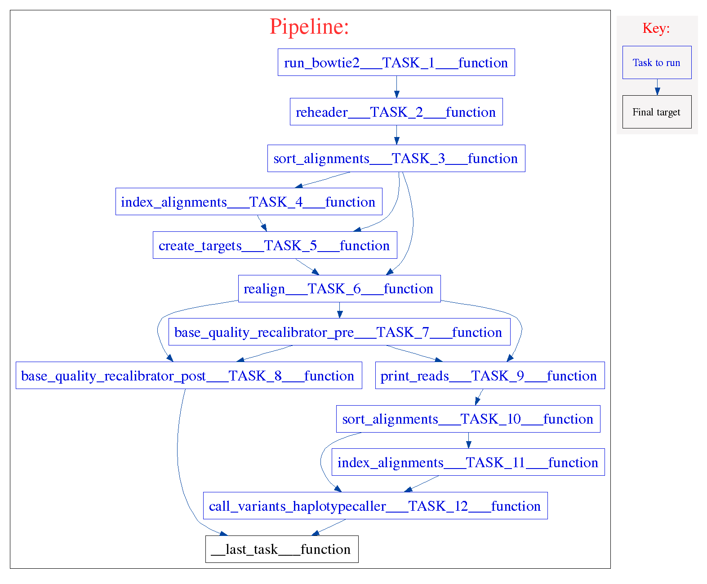

================
GATK workflow 
================
.. topic:: Development information

    * Date Created : March 31, 2015
    * Last Update  : 
    * Developer    : Radhouane Aniba (raniba@bccrc.ca)

.. here you can add the workflow plot

    
This workflow is an implementation of the best practices guide established by the Broad Institute applied to variant discovery using haplotypecaller 

.. note::

    For more information about the best practices guide please visit `Broad institute best practices <https://www.broadinstitute.org/gatk/guide/best-practices>`_.

The pipeline follows these steps:

* create a paired end alignment using Bowtie2 (TASK_1)
* reheading bam files using Piccard tools (TASK_2)
* sort and index alignments using samtools (TASK_3,4)
* create targets using GATK RealignerTargetCreator (TASK_5)
* proceed to a local realignment using the intervals generated (TASK_6)
* proceed to a two steps base quality recalibration (TASK_7,8)
* render the newly generated bam file (TASK_9)
* sort and index the newly generated realigned bam file (TASK_10,11)
* call SNPs and indels simultaneously via local re-assembly of haplotypes in an active region. (TASK_12)

Components
==========
* *component 1*:

 * component_name: `index_alignments <https://github.com/MO-BCCRC/index_alignments>`_
 * component_version: 1.0.0
 * seed_version: 0.1.19

* *component 2*:

 * component_name: `print_reads <https://github.com/MO-BCCRC/print_reads>`_
 * component_version: 1.0.0
 * seed_version: 3.1.1

* *component 3*:

 * component_name: `run_bowtie2 <https://github.com/MO-BCCRC/run_bowtie2>`_
 * component_version: 1.0.3
 * seed_version: 1.0.0

* *component 4*:

 * component_name: `call_variants_haplotypecaller <https://github.com/MO-BCCRC/call_variants_haplotypecaller>`_
 * component_version: 1.0.0
 * seed_version: 3.1.1

* *component 5*:

 * component_name: `realign <https://github.com/MO-BCCRC/realign>`_
 * component_version: 1.0.0
 * seed_version: 3.1.1

* *component 6*:

 * component_name: `base_quality_recalibrator_post <https://github.com/MO-BCCRC/base_quality_recalibrator_post>`_
 * component_version: 1.0.0
 * seed_version: 3.1.1

* *component 7*:

 * component_name: `create_targets <https://github.com/MO-BCCRC/create_targets>`_
 * component_version: 1.0.0
 * seed_version: 3.1.1

* *component 8*:

 * component_name: `reheader <https://github.com/MO-BCCRC/reheader>`_
 * component_version: 1.0.0
 * seed_version: 3.1.1

* *component 9*:

 * component_name: `sort_alignments <https://github.com/MO-BCCRC/sort_alignments>`_
 * component_version: 1.0.0
 * seed_version: 0.1.19

* *component 10*:

 * component_name: `base_quality_recalibrator_pre <https://github.com/MO-BCCRC/base_quality_recalibrator_pre>`_
 * component_version: 1.0.0
 * seed_version: 3.1.1
 
Requirements
============
* Kronos >=v2.0.4
* Python >= v2.7.6
* Java >= 1.7
* `Bowtie2 <https://github.com/BenLangmead/bowtie2>`_ == 2.0.2 
* `GATK <https://www.broadinstitute.org/gatk/download/>`_ == 3.1-1
* `Picard tools <http://broadinstitute.github.io/picard/>`_ == 1.71
* `Samtools <http://samtools.sourceforge.net/>`_ == 1.2

How to run the workflow
=======================    
**Step 1.** Update the ``setup.txt`` file provided with the workflow by passing proper paths/values to the *value* column.

.. note::

    The above file is a tab separated file and the first line, *i.e.* '``#section key value``', is part of the file.
    
**Step 2.** Update the ``input.txt`` file with proper paths/values.

.. note::

    The above file is a tab separated file and the first line, *i.e.* '``#sample_id ...``', is part of the file.
    Sample ID's are arbitrary.
    However, they cannot be used more than once in an input file.
      
**Step 3.** Run the workflow using the following command:

.. code:: bash
 
     kronos run -c <path/to/components_dir/ -e <a name for workflow> 
                -i <input.txt> -r <run_id> -s <setup.txt>  
                -w <workind_dir> -y <path/to/config.yaml>

Please note to replace ``<.>`` with the actual values.
See kronos online documentation for more information on the `run <http://kronos.readthedocs.org/en/latest/launch_pipeline/run.html#how-to-run-pipeline>`_ command.

Outputs
=======
The resulting files will be saved in the <working_dir>/<run_id> directory. 
Please refer to the Kronos online documentation for more information on the structure of the `results directory <http://kronos.readthedocs.org/en/latest/launch_pipeline/run.html#results-generated-by-a-pipeline>`_.

Changelog
=========
.. * <version>: added <sth>, etc.

